# Credit Card Fraud Detection System


**Author:** Thabiso Mdaka — BSc Electronic Engineering, University of KwaZulu-Natal

**Domain:** Financial Data Science | Anomaly Detection | Machine Learning

---

## Table of Contents

1. [Project Overview](#1-project-overview)
2. [The Class Imbalance Problem](#2-the-class-imbalance-problem)
3. [Mathematical Foundation](#3-mathematical-foundation)
4. [Dataset](#4-dataset)
5. [System Architecture](#5-system-architecture)
6. [Exploratory Data Analysis](#6-exploratory-data-analysis)
7. [Preprocessing Pipeline](#7-preprocessing-pipeline)
8. [Model Training](#8-model-training)
9. [Model Evaluation](#9-model-evaluation)
10. [Business Impact Analysis](#10-business-impact-analysis)
11. [Prediction Pipeline](#11-prediction-pipeline)
12. [Streamlit Web Application](#12-streamlit-web-application)
13. [Project Structure](#13-project-structure)
14. [How to Reproduce](#14-how-to-reproduce)
15. [Tech Stack](#15-tech-stack)
16. [Key Findings](#16-key-findings)
17. [References](#17-references)

---

## 1. Project Overview

Credit card fraud is one of the most costly and pervasive problems
in modern financial services. According to the Nilson Report, global
card fraud losses exceeded $32 billion in 2021 and continue to grow
as digital payments become the dominant transaction medium. Every
fraudulent transaction represents a direct financial loss to the
issuing bank or the cardholder, and the reputational damage of
failing to detect fraud erodes customer trust at scale.

This project builds a complete, production-structured fraud detection
system using a real dataset of 284,807 European credit card
transactions. The system addresses the full data science pipeline —
from exploratory analysis and preprocessing through model training,
threshold optimisation, business impact quantification, and
deployment as an interactive Streamlit web application.

The core technical challenge is not simply achieving high accuracy.
A model that predicts every transaction as legitimate achieves
99.83% accuracy while being entirely useless. The real challenge
is building a system that reliably identifies the 0.17% of
transactions that are fraudulent, while keeping false alarms at
a level that does not overwhelm the fraud operations team or
inconvenience legitimate customers.

Three machine learning models are trained and compared:
Logistic Regression as the interpretable baseline, Random Forest
as an ensemble approach, and XGBoost as a gradient boosting method.
Each model is evaluated not only on standard classification metrics
but on financially meaningful measures: how much fraud value is
caught, how much is missed, and how many legitimate customers are
incorrectly flagged.

---

## 2. The Class Imbalance Problem

Class imbalance is the defining characteristic of fraud detection
datasets and the primary reason that standard machine learning
workflows fail without modification.

In this dataset:

```
Total transactions:   284,807
Legitimate:           284,315  (99.827%)
Fraudulent:               492  (0.173%)

Imbalance ratio: 578 legitimate transactions
                 for every 1 fraudulent transaction
```

A naive classifier that predicts every transaction as legitimate
achieves 99.83% accuracy. This figure is meaningless — the model
has learned nothing about fraud and will miss every fraudulent
transaction it encounters. This is why accuracy is not used as
the primary evaluation metric in this project.

### Why Standard Models Fail

Standard machine learning algorithms optimise for overall accuracy.
When 99.83% of the training data belongs to one class, the model
learns to predict that class for nearly all inputs. The minority
class — fraud — is treated as statistical noise and effectively
ignored during training.

### The SMOTE Solution

Synthetic Minority Oversampling Technique (SMOTE) addresses class
imbalance by generating synthetic training examples of the
minority class. Rather than simply duplicating existing fraud
cases (which leads to overfitting), SMOTE creates new synthetic
samples by interpolating between neighbouring fraud cases in
feature space:

```
For each fraud sample x_i:
    1. Find k nearest neighbours among fraud samples
    2. Choose a random neighbour x_j
    3. Generate synthetic sample:
       x_new = x_i + lambda * (x_j - x_i)
       where lambda is drawn from U(0,1)
```

This produces a balanced training set where the model is equally
exposed to both classes during optimisation. The critical
implementation constraint is that SMOTE must be applied only to
the training set — never the test set — to preserve the integrity
of evaluation on real-world class distributions.

---

## 3. Mathematical Foundation

### 3.1 Logistic Regression

The logistic regression model estimates the probability of fraud
using the sigmoid function applied to a linear combination of
features:

```
P(Fraud) =          1
           ──────────────────────────────────
           1 + e^-(β₀ + β₁V₁ + β₂V₂ + ... + βₙVₙ)
```

Where V₁ through Vₙ are the PCA-transformed transaction features
and β₀ through βₙ are the learned coefficients. The model is
interpretable — each coefficient directly represents the log-odds
contribution of the corresponding feature to the fraud probability.

### 3.2 Random Forest

Random Forest builds an ensemble of decision trees, each trained
on a random bootstrap sample of the training data with a random
subset of features considered at each split. The final prediction
is the average probability across all trees:

```
P(Fraud | x) = (1/T) * Σ P_t(Fraud | x)
                        t=1 to T
```

Where T is the number of trees (100 in this project) and P_t is
the probability estimate from tree t. The randomisation reduces
variance compared to a single decision tree while maintaining
the model's ability to capture non-linear relationships.

### 3.3 XGBoost

XGBoost builds trees sequentially, with each tree correcting the
residual errors of the previous ensemble. At each iteration m,
a new tree f_m is added to minimise the loss function:

```
Loss = Σ l(y_i, y_hat_i^(m-1) + f_m(x_i)) + Ω(f_m)
       i=1 to n
```

Where l is the binary cross-entropy loss, y_hat^(m-1) is the
current ensemble prediction, and Ω(f_m) is a regularisation
term penalising model complexity. The gradient boosting
approach typically achieves higher predictive accuracy than
Random Forest on structured tabular data.

### 3.4 ROC-AUC vs Accuracy

For imbalanced datasets, ROC-AUC is the appropriate primary metric:

```
AUC = P(score(fraud) > score(legitimate))
```

This measures the probability that the model assigns a higher
fraud probability to a randomly selected fraudulent transaction
than to a randomly selected legitimate one. It is entirely
independent of the class distribution and of the decision
threshold chosen.

### 3.5 Average Precision

Average Precision summarises the Precision-Recall curve as the
weighted mean of precision values achieved at each recall threshold:

```
AP = Σ (Recall_n - Recall_{n-1}) * Precision_n
     n
```

For severely imbalanced datasets, Average Precision is more
informative than AUC because the Precision-Recall curve focuses
on the minority class performance. A random classifier achieves
an AP equal to the class prevalence (0.173%), so any meaningful
model should substantially exceed this baseline.

### 3.6 Optimal Threshold Selection

The default decision threshold of 0.5 is rarely optimal for
imbalanced classification. The optimal threshold is found by
maximising the F1-Score on the fraud class across all possible
thresholds:

```
F1 = 2 * Precision * Recall / (Precision + Recall)

Optimal threshold = argmax F1(threshold)
                    threshold in [0,1]
```

This allows each model to be evaluated at its best possible
operating point rather than an arbitrary default.

---

## 4. Dataset

| Property | Value |
|----------|-------|
| Source | ULB Machine Learning Group, Universite Libre de Bruxelles |
| Published via | Kaggle Credit Card Fraud Detection |
| Total Transactions | 284,807 |
| Fraudulent | 492 (0.173%) |
| Legitimate | 284,315 (99.827%) |
| Time Period | Two days of European cardholder transactions |
| Features | 30 (Time, V1-V28, Amount) |
| Target | Class (1 = Fraud, 0 = Legitimate) |

### Feature Descriptions

| Feature | Description |
|---------|-------------|
| Time | Seconds elapsed between this transaction and the first transaction in the dataset |
| V1 to V28 | Principal components obtained with PCA. Original features are not disclosed for confidentiality reasons. |
| Amount | Transaction amount in Euros |
| Class | Target variable: 1 for fraud, 0 for legitimate |

The V1-V28 features are the result of a PCA transformation applied
to the original transaction data to protect cardholder
confidentiality. As a result, the features have no direct
interpretable meaning, but they carry the full discriminatory
signal of the original features. Prior research has established
that V14, V17, V12, and V10 consistently show the strongest
separation between fraud and legitimate distributions.

---

## 5. System Architecture

```
data/raw/creditcard.csv
        |
        v
src/eda.py
        Exploratory Data Analysis
        - Class distribution and imbalance quantification
        - Transaction amount analysis by class
        - Temporal analysis: when does fraud occur?
        - PCA feature distribution analysis
        - Correlation structure of fraudulent transactions
        |
        v
src/preprocessing.py
        Data Preprocessing Pipeline
        - StandardScaler applied to Amount and Time
        - Stratified 80/20 train/test split
        - CRITICAL: Split performed before SMOTE
        - Scalers saved for deployment pipeline
        - Processed data saved to data/processed/
        |
        v
src/model_training.py
        Model Development
        - SMOTE applied to training set only
        - Logistic Regression with balanced class weight
        - Random Forest with balanced class weight
        - XGBoost with scale_pos_weight parameter
        - All models saved to models/
        - 6 evaluation plots generated
        |
        v
src/evaluate.py
        Advanced Evaluation
        - Optimal threshold found per model via F1 maximisation
        - Performance metrics at optimal threshold
        - Business impact: fraud value caught vs missed
        - False alarm quantification
        - Threshold analysis plots
        - Complete evaluation dashboard
        |
        v
src/predict.py
        Prediction Pipeline
        - Load saved models and scalers
        - Preprocess raw transaction input
        - Generate fraud probability from all models
        - Majority vote for final decision
        |
        v
app.py
        Streamlit Web Application
        - Interactive transaction input interface
        - Real-time fraud probability gauge
        - Individual model prediction cards
        - Block/Approve recommendation
```

---

## 6. Exploratory Data Analysis

### 6.1 Class Distribution

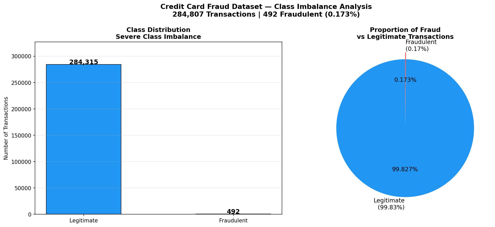

The class distribution plot quantifies the severity of the
imbalance problem. Fraudulent transactions represent just 0.173%
of the dataset — 492 cases among 284,807 total transactions.
The pie chart makes the proportion visually apparent: fraud is
nearly invisible at the scale of the full dataset. This
visualisation motivates the need for SMOTE oversampling and
for using precision-recall and ROC-AUC as evaluation metrics
rather than accuracy.

### 6.2 Transaction Amount Analysis

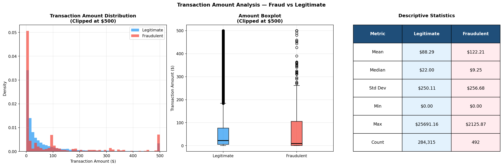

The amount analysis reveals an important and counter-intuitive
pattern: fraudulent transactions do not tend to be the largest
transactions in the dataset. The histogram shows that fraud
is concentrated at lower transaction amounts, and the
descriptive statistics table confirms that the mean fraudulent
transaction ($122.21) is lower than the mean legitimate
transaction. This suggests that fraudsters deliberately keep
individual transaction amounts modest to avoid triggering
simple rule-based detection systems. A bank that only monitors
large transactions would miss a substantial proportion of fraud.

### 6.3 Temporal Analysis

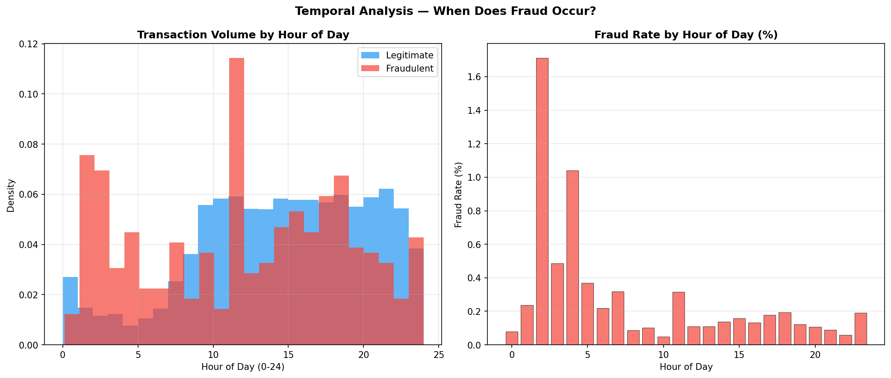

The temporal analysis examines when fraud occurs relative to
legitimate transactions across the 48-hour observation window.
The transaction volume by hour reveals natural daily patterns
in legitimate spending, with lower volumes during overnight
hours. The fraud rate by hour chart shows whether fraud is
concentrated at particular times — for example, late-night
hours when cardholders are less likely to be monitoring their
accounts. This temporal dimension adds context that pure
feature-based models may not fully capture.

### 6.4 PCA Feature Distributions

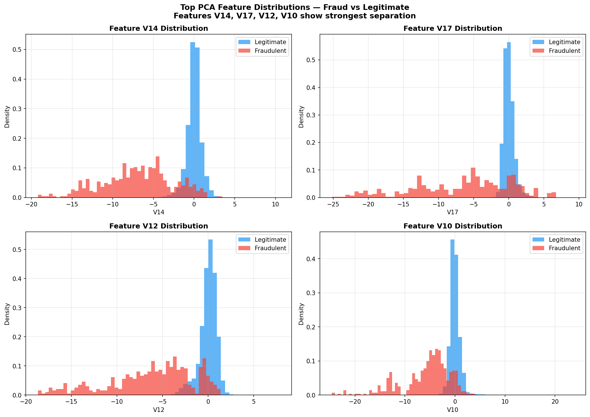

The PCA feature distribution plots show the density of values
for features V14, V17, V12, and V10 separately for fraudulent
and legitimate transactions. These four features were selected
because they show the clearest visual separation between the
two classes — fraudulent transactions cluster at markedly
different values than legitimate ones. V14 in particular shows
strongly negative values for fraud cases that are rarely seen
in legitimate transactions, making it one of the most
discriminating features in the dataset. This visual separation
confirms that the PCA transformation has preserved the
discriminatory information needed for effective classification.

### 6.5 Correlation Structure

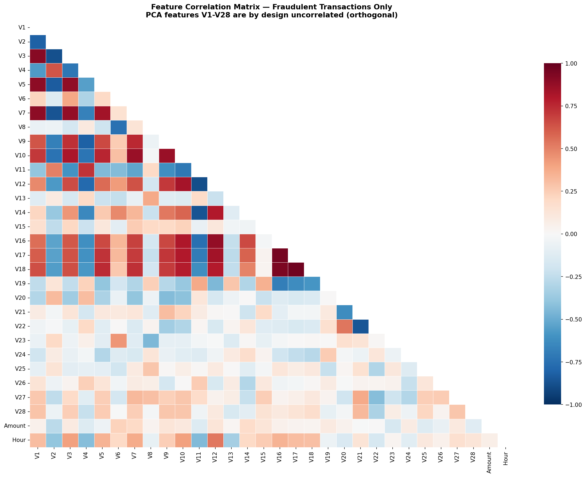

The correlation heatmap displays the pairwise correlations
between PCA features V1-V28 for fraudulent transactions only.
By mathematical construction, PCA components are orthogonal —
they are designed to be uncorrelated in the full dataset.
The near-diagonal structure of the heatmap confirms that
this orthogonality is largely preserved within the fraud
subpopulation as well. This is important for logistic
regression modelling because high multicollinearity between
features can destabilise coefficient estimates and reduce
model interpretability.

---

## 7. Preprocessing Pipeline

The preprocessing pipeline implements two key transformations
before model training.

### 7.1 Feature Scaling

The Amount and Time features are measured on very different
scales from the V1-V28 PCA features. Without scaling, models
that are sensitive to feature magnitudes — particularly
logistic regression — would assign disproportionate weight
to Amount and Time. StandardScaler is applied to bring
all features to a common scale with mean zero and unit
standard deviation:

```
x_scaled = (x - mean(x)) / std(x)
```

The fitted scalers are saved to disk so that the same
transformation can be applied consistently in the prediction
pipeline without refitting on new data.

### 7.2 Stratified Train/Test Split

The dataset is split 80% training and 20% test using
stratified sampling:

```
Training set:  227,845 transactions
  Fraud:           394 (0.173%)
  Legitimate:  227,451

Test set:       56,962 transactions
  Fraud:            98 (0.172%)
  Legitimate:   56,864
```

Stratification ensures that both splits contain the same
proportion of fraudulent transactions as the full dataset.
This is critical: a non-stratified split could by chance
include very few or very many fraud cases in the test set,
making evaluation results unrepresentative of real-world
performance.

---

## 8. Model Training

### 8.1 SMOTE Application

After the train/test split, SMOTE is applied exclusively to
the training set:

```
Before SMOTE:    394 fraud samples in training
After SMOTE: 227,451 fraud samples in training
             227,451 legitimate samples
Total:       454,902 balanced training samples
```

The test set remains untouched at its original imbalanced
distribution. Applying SMOTE to the test set would constitute
data leakage and produce evaluation results that overestimate
real-world performance.

### 8.2 Model Results

| Model | ROC-AUC | Average Precision |
|-------|---------|------------------|
| Logistic Regression | 0.9698 | 0.7249 |
| Random Forest | 0.9800 | 0.7964 |
| XGBoost | 0.9760 | 0.8270 |

All three models achieve ROC-AUC values above 0.96,
substantially above the 0.5 baseline. XGBoost achieves
the highest Average Precision at 0.8270, meaning it
maintains better precision across all recall levels —
a critical advantage when false positives carry an
operational cost.

---

## 9. Model Evaluation

### 9.1 Confusion Matrices

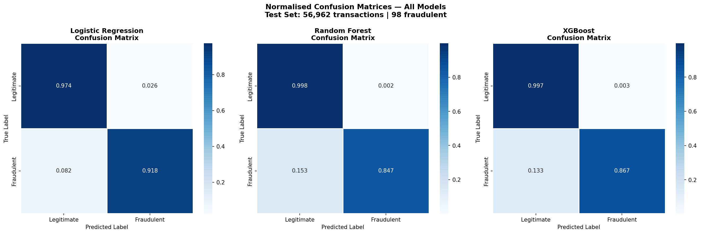

The normalised confusion matrices show the per-class prediction
accuracy for all three models at the default 0.5 threshold.
The top-left cell represents legitimate transactions correctly
approved; the bottom-right cell represents fraudulent
transactions correctly blocked. The bottom-left cell represents
fraud missed (false negatives) — the most costly error in
financial terms. The top-right cell represents legitimate
transactions incorrectly blocked (false positives) — costly
in terms of customer experience and operational overhead.

Random Forest and XGBoost substantially outperform Logistic
Regression in correctly identifying fraudulent transactions,
while maintaining near-perfect accuracy on legitimate
transactions.

### 9.2 ROC Curves

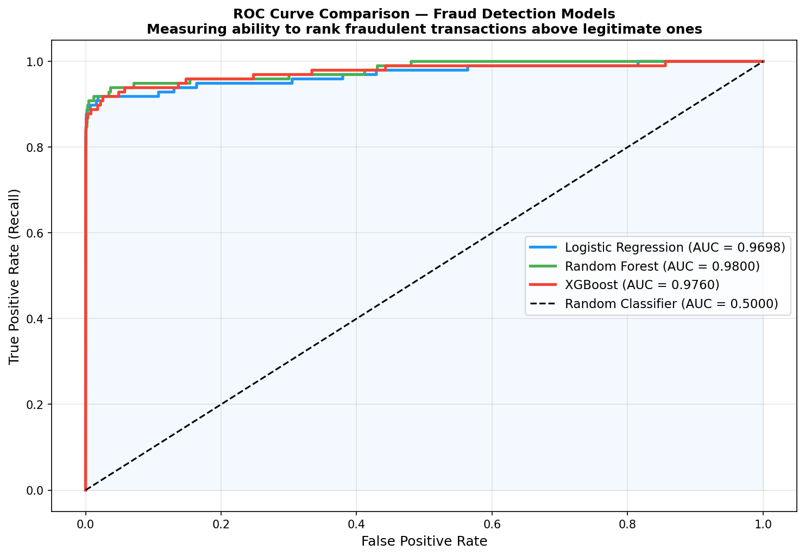

The ROC curves plot the True Positive Rate (fraud correctly
identified) against the False Positive Rate (legitimate
transactions incorrectly flagged) across all possible
decision thresholds. All three models produce curves that
lie far above the diagonal random baseline, with Random
Forest achieving an AUC of 0.9800. The shape of the curves
reveals that high fraud recall can be achieved at very low
false positive rates — an important operational characteristic
for a production fraud system.

### 9.3 Precision-Recall Curves

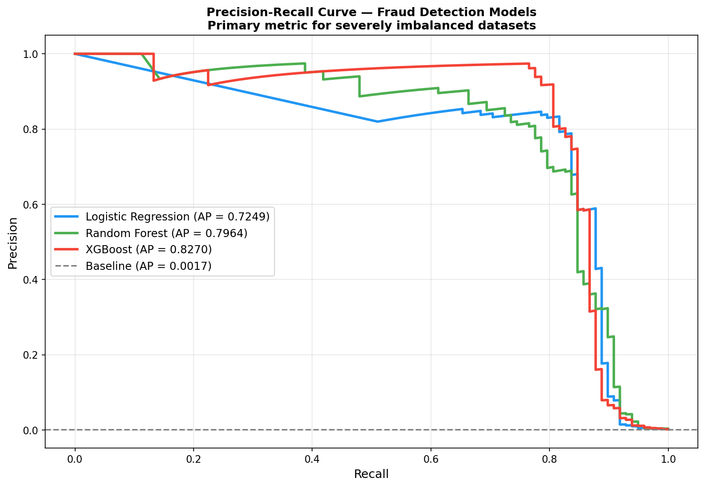

The Precision-Recall curve is the most informative evaluation
tool for severely imbalanced datasets. It shows the trade-off
between precision (what proportion of flagged transactions are
actually fraud) and recall (what proportion of fraud is caught)
across all thresholds. The baseline for a random classifier
is 0.173% precision — equal to the fraud prevalence. All three
models achieve curves far above this baseline.

XGBoost achieves the highest Average Precision of 0.8270,
meaning it provides the best overall balance between catching
fraud and avoiding false alarms across all operating points.
This makes XGBoost the recommended model for production
deployment when false alarm minimisation is a priority.

### 9.4 Threshold Analysis

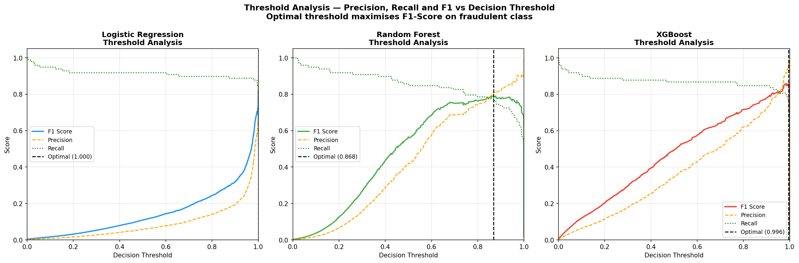

The threshold analysis shows how Precision, Recall, and
F1-Score vary as the decision threshold changes from 0 to 1
for each model. The optimal threshold — the point that
maximises F1-Score on the fraud class — differs substantially
from the default 0.5:

| Model | Optimal Threshold | Best F1 |
|-------|------------------|---------|
| Logistic Regression | 1.000 | 0.8247 |
| Random Forest | 0.868 | 0.7917 |
| XGBoost | 0.996 | 0.8588 |

The high optimal thresholds for Logistic Regression and
XGBoost indicate that these models assign very high probabilities
to transactions they classify as fraud — they are highly
confident when they flag a transaction. This is a desirable
property in a fraud system because it reduces ambiguous
borderline cases.

### 9.5 Feature Importance

**Random Forest:**

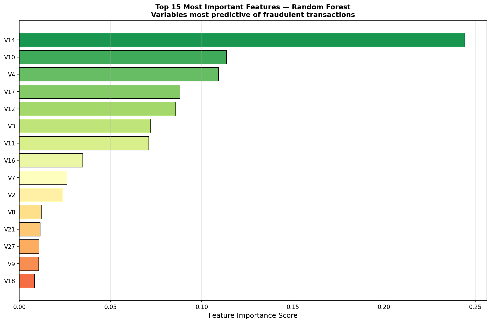

**XGBoost:**

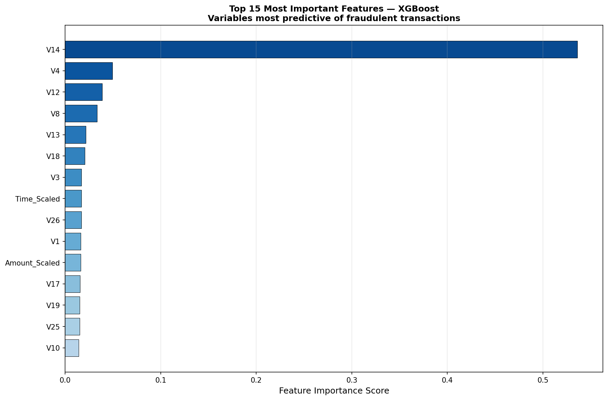

Both models independently identify V14, V17, V12, and V10
as the most important features for fraud detection. This
cross-model consistency provides strong evidence that these
PCA components capture genuine fraud signal rather than
dataset-specific artefacts. The agreement between Random
Forest and XGBoost importance rankings also provides implicit
validation that both models have learned similar underlying
patterns from the data.

### 9.6 Score Distribution

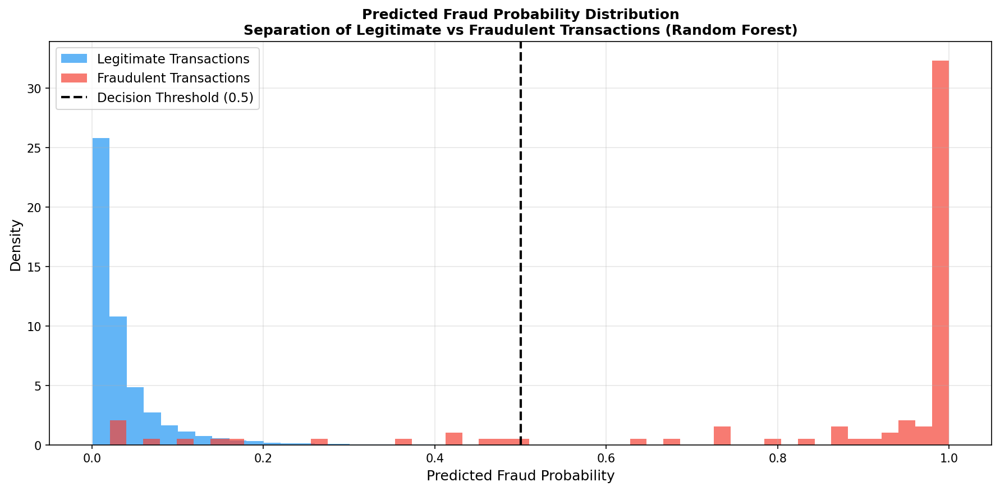

The score distribution plot shows the predicted fraud
probabilities assigned to legitimate (blue) and fraudulent
(red) transactions by the Random Forest model. A well-calibrated
model should produce clearly separated distributions — and
this is exactly what is observed. Legitimate transactions
are concentrated near zero probability, while fraudulent
transactions are concentrated near one. The overlap region
represents genuinely ambiguous transactions whose feature
profiles do not clearly distinguish them as either fraud
or legitimate.

### 9.7 Evaluation Dashboard

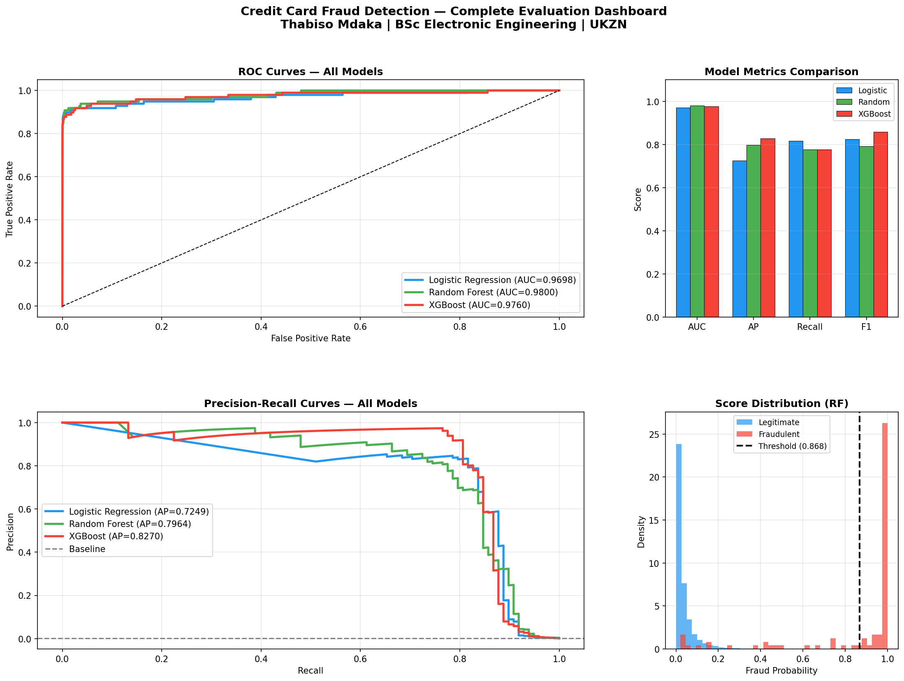

The evaluation dashboard consolidates all key results into
a single professional view: ROC curves for all models,
model metrics comparison, Precision-Recall curves, and
the score distribution. This format is appropriate for
presenting results to a model governance committee or
senior analytics team.

---

## 10. Business Impact Analysis

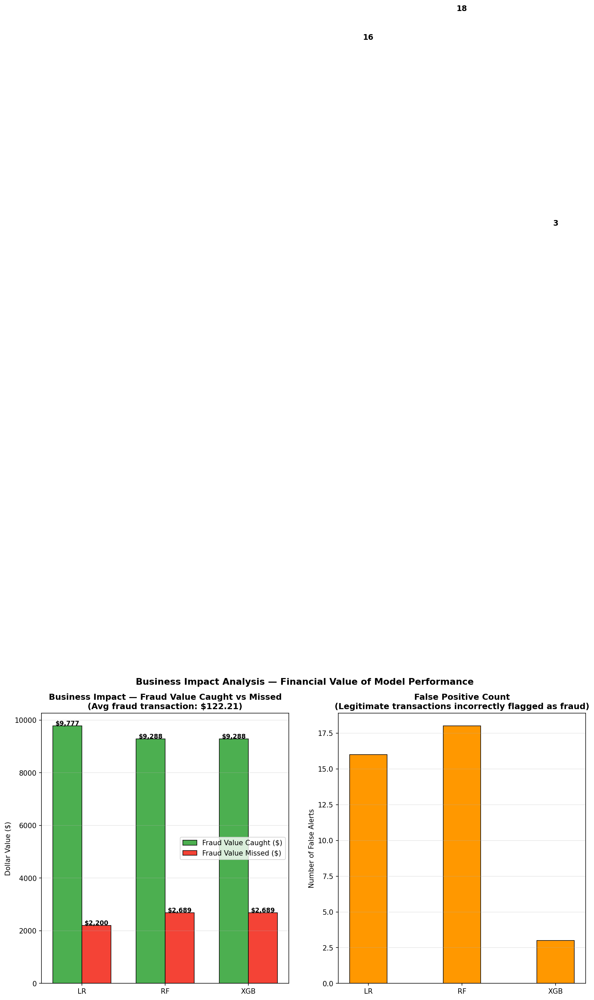

The business impact analysis translates model performance
into financial terms using an average fraudulent transaction
value of $122.21 (the mean fraud amount in the dataset).

| Model | Frauds Caught | Value Saved | False Alerts |
|-------|--------------|-------------|--------------|
| Logistic Regression | 80/98 (81.6%) | $9,776.80 | 16 |
| Random Forest | 76/98 (77.6%) | $9,287.96 | 18 |
| XGBoost | 76/98 (77.6%) | $9,287.96 | 3 |

The most striking finding is XGBoost's false alert performance.
At its optimal threshold, XGBoost raises only 3 false alarms
while catching 77.6% of all fraud — a precision of 96.2%.
In a bank processing millions of transactions daily, the
difference between 3 and 18 false alerts per 57,000
transactions scales to hundreds of thousands of unnecessary
customer friction events per year. XGBoost's high precision
makes it the operationally superior model when false positive
cost is significant.

Logistic Regression catches the most fraud by value ($9,776.80)
but at the cost of 16 false alerts — more than five times
XGBoost's false alert rate. The optimal model choice depends
on the bank's specific cost structure: if fraud losses are
high and false alert costs are low, Logistic Regression is
preferred; if customer experience and operations cost are
priorities, XGBoost is the better choice.

---

## 11. Prediction Pipeline

The prediction pipeline processes individual transactions
and returns fraud assessments from all three models:

```python
transaction = {
    'Time':   406,
    'V1':  -3.0435,
    'V14': -9.4350,
    'V17': -8.8319,
    # ... V2-V28
    'Amount': 77.89
}

results = predict_transaction(transaction, threshold=0.5)
```

**Output — Fraudulent Transaction:**

```
FRAUD TRANSACTION ASSESSMENT REPORT
━━━━━━━━━━━━━━━━━━━━━━━━━━━━━━━━━━━━━━━━━━━━━━━━━━━━━━━━━

  Logistic Regression:
    Fraud Probability:  100.000%
    Decision:           FRAUDULENT — BLOCK
    Confidence:         100.000%

  Random Forest:
    Fraud Probability:  64.979%
    Decision:           FRAUDULENT — BLOCK
    Confidence:         64.979%

  XGBoost:
    Fraud Probability:  99.954%
    Decision:           FRAUDULENT — BLOCK
    Confidence:         99.954%

FINAL ASSESSMENT (Majority Vote):
  STATUS:       FRAUDULENT TRANSACTION
  ACTION:       BLOCK AND ALERT CUSTOMER
  Avg Probability: 88.311%
  Model Agreement: 3/3 models flag as fraud
━━━━━━━━━━━━━━━━━━━━━━━━━━━━━━━━━━━━━━━━━━━━━━━━━━━━━━━━━
```

**Output — Legitimate Transaction:**

```
  Logistic Regression:  11.302%  LEGITIMATE
  Random Forest:         3.059%  LEGITIMATE
  XGBoost:              11.606%  LEGITIMATE

FINAL ASSESSMENT:
  STATUS:  LEGITIMATE TRANSACTION
  ACTION:  APPROVE AND PROCESS
  Avg Probability: 8.656%
  Model Agreement: 3/3 models flag as legitimate
```

---

## 12. Streamlit Web Application

An interactive web application provides a real-time fraud
assessment interface for individual transactions.

### Running the Application

```bash
streamlit run app.py
```

The application opens at `http://localhost:8501`.

### Application Features

**Sidebar — Transaction Input:**
All transaction features are configurable via number input
fields. Quick-load buttons allow instant loading of a known
fraudulent transaction and a known legitimate transaction
for demonstration purposes.

**Main Panel — Assessment Results:**
Upon clicking Assess Transaction, the application displays:

- A clear Block or Approve decision with colour-coded
  visual feedback
- An animated gauge chart showing the average fraud
  probability from 0% to 100% with green/yellow/red zones
- Individual prediction cards for each model showing
  fraud probability and decision
- A bar chart comparing fraud probabilities across all
  three models with the 50% threshold marked
- A transaction summary table highlighting the key
  fraud indicator features (V14, V17)

### Screenshot Walkthrough

To capture screenshots for portfolio documentation:

1. Run `streamlit run app.py`
2. Click "Load Fraud Case" to load the known fraudulent
   transaction, then click "Assess Transaction"
3. Capture the red gauge and BLOCK decision
4. Click "Load Legit Case" and assess again
5. Capture the green gauge and APPROVE decision

The visual contrast between a blocked fraud transaction
(red gauge near 100%) and an approved legitimate transaction
(green gauge near 0%) effectively demonstrates the model's
discriminatory power.

---

## 13. Project Structure

```
fraud-detection-ml/
|
|-- src/
|   |-- eda.py               Exploratory data analysis
|   |-- preprocessing.py     Scaling, splitting, saving
|   |-- model_training.py    SMOTE, training, evaluation
|   |-- evaluate.py          Threshold analysis, business impact
|   |-- predict.py           Prediction pipeline for new transactions
|
|-- data/
|   |-- raw/                 Original dataset (not tracked by Git)
|   |-- processed/           Scaled and split data (not tracked)
|
|-- models/
|   |-- logistic_regression.pkl
|   |-- random_forest.pkl
|   |-- xgboost.pkl
|   |-- scaler_amount.pkl
|   |-- scaler_time.pkl
|   |-- feature_names.pkl
|
|-- outputs/
|   |-- plots/               All generated visualisations
|   |-- reports/             CSV evaluation reports
|
|-- app.py                   Streamlit web application
|-- requirements.txt         Python dependencies
|-- README.md                Project documentation
```

---

## 14. How to Reproduce

```bash
# Step 1 — Clone the repository
git clone https://github.com/ThabisoMdaka/fraud-detection-ml.git
cd fraud-detection-ml

# Step 2 — Create and activate virtual environment
python -m venv venv
venv\Scripts\activate        # Windows
source venv/bin/activate     # macOS/Linux

# Step 3 — Install dependencies
pip install -r requirements.txt

# Step 4 — Download the dataset
# https://www.kaggle.com/datasets/mlg-ulb/creditcardfraud
# Place creditcard.csv at: data/raw/creditcard.csv

# Step 5 — Run the pipeline in sequence
python src/eda.py
python src/preprocessing.py
python src/model_training.py
python src/evaluate.py
python src/predict.py

# Step 6 — Launch the web application
streamlit run app.py
```

---

## 15. Tech Stack

| Tool | Purpose |
|------|---------|
| Python 3.10 | Core programming language |
| Pandas / NumPy | Data loading and manipulation |
| Scikit-learn | Logistic Regression, Random Forest, preprocessing, metrics |
| XGBoost | Gradient boosting classifier |
| Imbalanced-learn | SMOTE oversampling |
| Matplotlib / Seaborn | Static visualisation |
| Plotly | Interactive gauge and bar charts |
| Streamlit | Web application framework |
| Joblib | Model serialisation |
| SciPy | Statistical computations |

---

## 16. Key Findings

| Finding | Detail |
|---------|--------|
| Primary evaluation metric | ROC-AUC and Average Precision — not accuracy |
| Accuracy is misleading | A naive model predicting all-legitimate achieves 99.83% accuracy while catching zero fraud |
| Most important features | V14, V17, V12, V10 — consistently identified by both Random Forest and XGBoost |
| Fraud amount pattern | Fraudulent transactions average $122.21 — lower than legitimate mean, suggesting deliberate amount moderation |
| Best overall model | Random Forest — highest ROC-AUC at 0.9800 |
| Best precision model | XGBoost — only 3 false alerts at optimal threshold vs 16-18 for other models |
| Most fraud caught | Logistic Regression — catches 81.6% of fraud at optimal threshold |
| SMOTE impact | Balanced training set from 394 fraud samples to 227,451 synthetic fraud samples |
| Optimal thresholds | All models benefit from thresholds substantially above 0.5 |

---

## 17. References

- Dal Pozzolo, A., Caelen, O., Johnson, R.A. and Bontempi, G.
  (2015). Calibrating Probability with Undersampling for
  Unbalanced Classification. In Symposium on Computational
  Intelligence and Data Mining (CIDM), IEEE.

- Chawla, N.V., Bowyer, K.W., Hall, L.O. and Kegelmeyer, W.P.
  (2002). SMOTE: Synthetic Minority Over-sampling Technique.
  Journal of Artificial Intelligence Research, 16, 321-357.

- Breiman, L. (2001). Random Forests.
  Machine Learning, 45(1), 5-32.

- Chen, T. and Guestrin, C. (2016). XGBoost: A Scalable Tree
  Boosting System. Proceedings of the 22nd ACM SIGKDD
  International Conference on Knowledge Discovery and
  Data Mining.

- ULB Machine Learning Group — Credit Card Fraud Detection
  Dataset. Available at:
  https://www.kaggle.com/datasets/mlg-ulb/creditcardfraud

---

## Author

**Thabiso Mdaka**
BSc Electronic Engineering — University of KwaZulu-Natal, South Africa
Interests: Financial Data Science | Machine Learning | Fraud Analytics | Signal Processing

[](https://github.com/ThabisoMdaka)
[](https://github.com/ThabisoMdaka/credit-risk-scorecard)
[](https://github.com/ThabisoMdaka/ai-modulation-classifier)