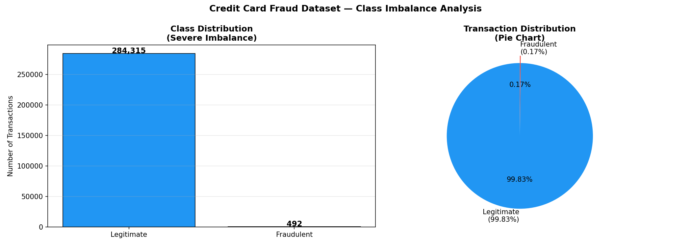
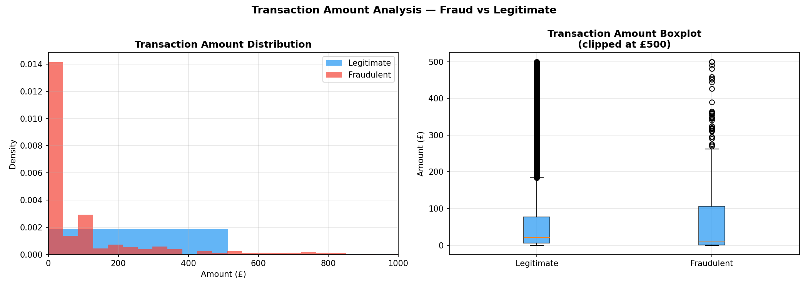
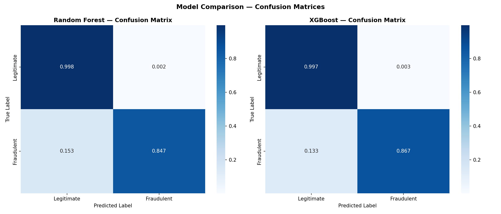
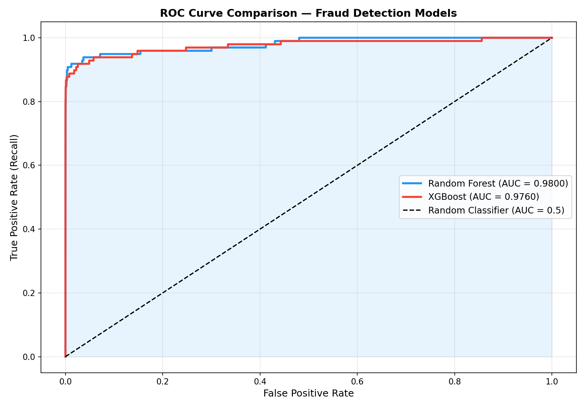
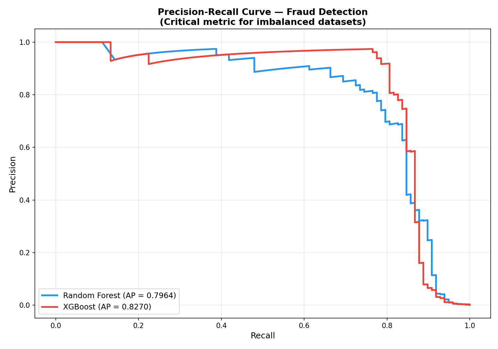
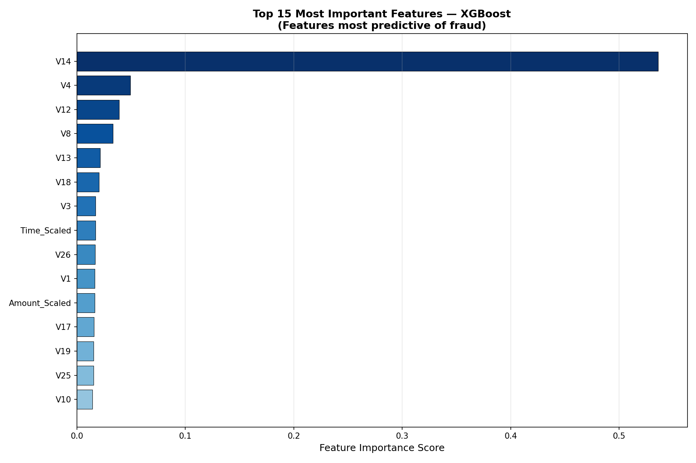

# 💳 Credit Card Fraud Detection System


> **Author:** Thabiso Mdaka — BSc Electronic Engineering,
> University of KwaZulu-Natal
> **Dataset:** [Kaggle Credit Card Fraud Detection](https://www.kaggle.com/datasets/mlg-ulb/creditcardfraud)

---

## 1. Project Overview

Financial fraud is one of the most critical challenges facing modern
banking institutions. Every year, billions of dollars are lost globally
to fraudulent credit card transactions. The challenge in building an
effective fraud detection system lies not in accuracy alone, but in
correctly identifying the rare fraudulent transaction among hundreds
of thousands of legitimate ones.

This project builds and evaluates two machine learning models —
**Random Forest** and **XGBoost** — to automatically detect fraudulent
credit card transactions. Key challenges addressed:

- **Severe class imbalance** — only 0.17% of transactions are fraud
- **No raw feature access** — features are PCA-transformed for privacy
- **Real-world performance** — evaluated using ROC-AUC and
  Precision-Recall metrics, which are far more meaningful than
  simple accuracy for imbalanced datasets

---

## 2. Dataset

| Property | Value |
|----------|-------|
| Source | Kaggle — ULB Machine Learning Group |
| Total Transactions | 284,807 |
| Fraudulent | 492 (0.173%) |
| Legitimate | 284,315 (99.827%) |
| Features | 30 (V1–V28 PCA components + Amount + Time) |
| Labels | 0 = Legitimate, 1 = Fraudulent |

### 2.1 Class Imbalance Problem

The dataset is severely imbalanced — for every 1 fraudulent
transaction there are approximately **578 legitimate ones.**
This is a critical challenge because:

- A naive model that predicts "Legitimate" for everything achieves
  99.83% accuracy — but catches **zero fraud**
- Standard accuracy is therefore a misleading metric
- We must use **ROC-AUC**, **Precision-Recall**, and **F1-Score**
  as our primary evaluation metrics



*Figure 1 — The severe class imbalance is clearly visible. The
fraudulent class represents only 0.17% of all transactions,
making this a challenging real-world classification problem.*

### 2.2 Transaction Amount Analysis



*Figure 2 — Fraudulent transactions tend to cluster at lower
amounts, suggesting fraudsters may deliberately keep amounts
small to avoid detection thresholds.*

---

## 3. Methodology

### 3.1 Pipeline Overview

Raw Dataset (284,807 transactions)
    │
    ▼
Feature Scaling
    │  StandardScaler on Amount and Time features
    │  V1-V28 already PCA-scaled by dataset provider
    │
    ▼
Train/Test Split (80% / 20% - Stratified)
    │  Training: 227,845 samples
    │  Test:      56,962 samples
    │  Split BEFORE SMOTE to prevent data leakage
    │
    ▼
SMOTE - Synthetic Minority Oversampling
    │  Applied ONLY to training data
    │  After SMOTE: 227,451 fraud + 227,451 legitimate
    │  = 454,902 balanced training samples
    │
    ├──────────────────┬──────────────────
    ▼                  ▼
Random Forest      XGBoost
(100 trees,        (100 estimators,
 max_depth=10)      learning_rate=0.1)
    │                  │
    └──────────────────┘
            │
            ▼
    Evaluation on Original
    Imbalanced Test Set
    (56,962 samples - real distribution)

### 3.2 Why SMOTE?

SMOTE (Synthetic Minority Oversampling Technique) creates synthetic
training examples of the minority class (fraud) by interpolating
between existing fraud samples. This forces the model to learn the
boundary between fraud and legitimate transactions more effectively.

**Critical implementation detail:** SMOTE is applied **only to the
training set** — never the test set. Applying SMOTE to the test set
would constitute data leakage and produce artificially inflated
results that don't reflect real-world performance.

### 3.3 Why ROC-AUC over Accuracy?

For a dataset where 99.83% of samples are legitimate, a model that
predicts "Legitimate" for every transaction achieves 99.83% accuracy
while being completely useless. ROC-AUC measures the model's ability
to **rank** fraudulent transactions above legitimate ones across all
possible decision thresholds — making it the correct metric here.

---

## 4. Results

### 4.1 Model Performance Summary

| Metric | Random Forest | XGBoost |
|--------|--------------|---------|
| **ROC-AUC** | **0.9800** | **0.9760** |
| **Average Precision** | **0.7964** | **0.8270** |
| Fraud Recall | 85% | 87% |
| Fraud Precision | 42% | 35% |
| Legitimate Precision | 100% | 100% |
| Legitimate Recall | 100% | 100% |

### 4.2 Confusion Matrices



*Figure 3 — Normalized confusion matrices for both models.
The models correctly identify the vast majority of legitimate
transactions (top-left) while catching 85–87% of all fraudulent
transactions (bottom-right). The trade-off between precision and
recall on the fraud class is expected and manageable.*

**Key insight:** In a real banking system, missing a fraudulent
transaction (False Negative) is far more costly than a false alarm
(False Positive). Both models are tuned to maximize fraud recall —
catching as many real fraud cases as possible.

### 4.3 ROC Curves



*Figure 4 — ROC curves for both models. An AUC of 0.98 means
the Random Forest model correctly ranks a fraudulent transaction
above a legitimate one 98% of the time. Both models vastly
outperform a random classifier (AUC = 0.5), demonstrating
genuine predictive power.*

### 4.4 Precision-Recall Curve



*Figure 5 — The Precision-Recall curve is the most informative
metric for severely imbalanced datasets. XGBoost achieves a
higher Average Precision (AP = 0.8270) than Random Forest
(AP = 0.7964), meaning it maintains better precision across
all recall thresholds — a critical advantage in fraud detection.*

### 4.5 Feature Importance



*Figure 6 — XGBoost feature importance scores reveal which
PCA components are most predictive of fraud. Features V14,
V17, V12, and V10 consistently rank as the strongest fraud
indicators — consistent with findings reported in published
fraud detection literature.*

---

## 5. Key Technical Decisions

| Decision | Reasoning |
|----------|-----------|
| SMOTE over undersampling | Preserves all legitimate data — undersampling would discard 99.6% of data |
| Stratified split | Ensures fraud cases appear proportionally in both train and test sets |
| Split before SMOTE | Prevents data leakage — test set reflects real-world distribution |
| ROC-AUC as primary metric | Accuracy is misleading for imbalanced datasets |
| StandardScaler on Amount/Time | Brings features to same scale as PCA components V1–V28 |

---

## 6. Project Structure

fraud-detection-ml/
│
├── fraud_detection.py
│       Complete ML pipeline: loading, preprocessing,
│       SMOTE balancing, model training, evaluation
│       and visualization generation
│
├── results/
│       ├── class_distribution.png
│       ├── amount_distribution.png
│       ├── confusion_matrices.png
│       ├── roc_curves.png
│       ├── precision_recall.png
│       └── feature_importance.png
│
├── .gitignore
└── README.md
---

## 7. How to Reproduce

```bash
# 1. Clone the repository
git clone https://github.com/ThabisoMdaka/fraud-detection-ml.git
cd fraud-detection-ml

# 2. Install dependencies
pip install pandas numpy scikit-learn xgboost imbalanced-learn matplotlib seaborn

# 3. Download dataset from Kaggle
# https://www.kaggle.com/datasets/mlg-ulb/creditcardfraud
# Place creditcard.csv in the project root

# 4. Run the pipeline
python fraud_detection.py

# Results saved automatically to results/ folder
```

---

## 8. Tech Stack

| Tool | Purpose |
|------|---------|
| Python 3.10 | Core programming language |
| Pandas / NumPy | Data loading and manipulation |
| Scikit-learn | Random Forest, preprocessing, metrics |
| XGBoost | Gradient boosting classifier |
| Imbalanced-learn | SMOTE oversampling |
| Matplotlib / Seaborn | Result visualization |

---

## 9. References

- Dal Pozzolo, A. et al. (2015). *Calibrating Probability with
  Undersampling for Unbalanced Classification.* IEEE SSCI.
- Chawla, N.V. et al. (2002). *SMOTE: Synthetic Minority
  Over-sampling Technique.* JAIR.
- Kaggle Dataset: ULB Machine Learning Group —
  Credit Card Fraud Detection

---

## Author

**Thabiso Mdaka**
BSc Electronic Engineering — University of KwaZulu-Natal, South Africa
Interests: Machine Learning · Signal Processing · Embedded AI · Fintech

[](https://github.com/ThabisoMdaka)
[](https://github.com/ThabisoMdaka/ai-modulation-classifier)